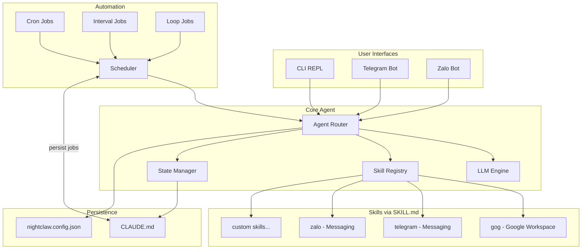
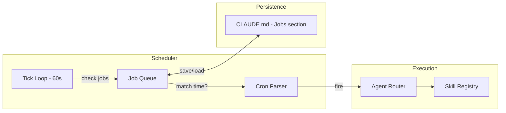

# AI Agent Skills System for Nightclaw

## Current State

Nightclaw is a simple AI CLI with:
- Interactive REPL and single-prompt mode (`src/cli/interactive.ts`)
- OpenAI-compatible LLM streaming (`src/agent/llm.ts`)
- JSON config (`src/config/index.ts`)
- One example skill: `src/skills/gog/SKILL.md`

## Architecture



---

## Phase 1 -- Skill Registry and Parser

Build the core system that discovers, parses, and loads SKILL.md files so the LLM knows what tools are available.

**Files to create:**
- `src/skills/types.ts` -- TypeScript types for Skill, SkillMetadata, SkillCommand
- `src/skills/parser.ts` -- Parse SKILL.md YAML frontmatter + extract command blocks from markdown body
- `src/skills/registry.ts` -- Scan `src/skills/*/SKILL.md`, parse and load all skills

**SKILL.md contract** (follows existing gog SKILL.md pattern):

```yaml
---
name: <service-name>
description: <one-line description>
homepage: <url>
metadata:
  nightclaw:
    emoji: "<emoji>"
    requires: { bins: ["<cli-tool>"] }
    install: [...]
    type: "tool" | "interface"
---
```

- `type: "tool"` -- The agent calls this service (e.g., gog for Gmail)
- `type: "interface"` -- The agent listens on this service (e.g., Telegram bot)

**Skill loading flow:**
1. On startup, scan `src/skills/*/SKILL.md`
2. Parse each file into a `Skill` object
3. Inject tool-type skills into the LLM system prompt so it knows available commands
4. Start interface-type skills as listeners (Phase 3)

---

## Phase 2 -- Agent Core with Conversational Intelligence

Upgrade the agent to understand everything through natural chat. No slash commands needed -- the user just talks.

**Core principle:** The user never types `/setup` or `/cron` or `/start`. They say things like:
- "help me setup zalo bot"
- "here's my telegram token: 123456:ABC"
- "remind me every Monday to send the weekly report"
- "start the telegram bot"
- "show me my scheduled jobs"

The LLM understands intent and calls internal tools (functions) to execute.

**Files to create/modify:**
- `src/agent/index.ts` -- Accept a skill list, route to tools based on LLM function calls
- `src/agent/llm.ts` -- Support multi-turn messages, OpenAI-compatible function calling / tool_use
- `src/agent/system-prompt.ts` (new) -- Generate system prompt dynamically from loaded skills
- `src/agent/tools.ts` (new) -- Internal tool definitions the LLM can call

**Internal tools exposed to LLM (via function calling):**

| Tool | Description |
|------|-------------|
| `save_config` | Save a service credential to config |
| `read_config` | Read current service config |
| `run_shell` | Execute a shell command (skill CLI) |
| `start_service` | Start a service adapter (telegram, zalo) |
| `stop_service` | Stop a running service adapter |
| `create_job` | Schedule a cron/interval/loop/once job |
| `list_jobs` | List all scheduled jobs |
| `cancel_job` | Cancel a scheduled job |
| `update_notes` | Update a section of the user's notes in CLAUDE.md |
| `read_state` | Read current CLAUDE.md state |

**Conversational setup flow example:**

```
user> help me setup telegram bot
ai>   Sure! I need your Telegram Bot token.
      You can get one from @BotFather on Telegram.
      Just paste it here when you have it.

user> 7123456789:AAHfiqksKZ8WmR2zMqNcaQ
ai>   Got it! Let me save that and start the bot...
      Your Telegram bot is now running! Try sending it a message.
```

---

## Phase 3 -- Service Interfaces (Telegram, Zalo)

Each messaging service is both a skill (SKILL.md) and a runtime adapter. All setup is done through natural chat -- user just pastes credentials and the AI handles the rest.

### Telegram

- `src/skills/telegram/SKILL.md` -- Documents Bot API capabilities
- `src/skills/telegram/adapter.ts` -- Uses `node-telegram-bot-api` for long-polling, pipes messages through Agent Router, sends replies back
- Config key: `services.telegram.botToken`

**Setup flow (all conversational):**

```
user> help me setup telegram
ai>   To set up Telegram, I need a Bot Token from @BotFather.
      1. Open Telegram, search for @BotFather
      2. Send /newbot and follow the steps
      3. Paste the token here

user> 7123456789:AAHfiqksKZ8WmR2zMqNcaQ
ai>   Saved! Starting your Telegram bot now...
      Bot @your_bot is online and listening.
```

### Zalo (via zca-js)

Uses [zca-js](https://zca-js.tdung.com/vi/get-started/introduction) -- an unofficial library that lets you build a Zalo chatbot using your personal account. Supports message listening, sending, reactions, group management, and more.

- `src/skills/zalo/SKILL.md` -- Documents zca-js API (sendMessage, getAllGroups, getUserInfo, etc.)
- `src/skills/zalo/adapter.ts` -- Uses `zca-js` library: login with cookie/QR, listen for messages, pipe through Agent Router
- Config key: `services.zalo.cookie` (cookie JSON string for login)

**zca-js key features used:**
- Login: cookie-based or QR code
- Listen: `api.listener.on("message", ...)` for incoming messages
- Send: `api.sendMessage(text, threadId)` to reply
- Groups: `api.getAllGroups()`, `api.getGroupInfo()`, `api.addUserToGroup()`
- Users: `api.getUserInfo()`, `api.findUser()`

**Warning:** zca-js is unofficial and may risk account suspension.

### Adapter interface (shared):

```typescript
interface ServiceAdapter {
  name: string;
  start(agent: AgentRouter): Promise<void>;
  stop(): Promise<void>;
  sendMessage(chatId: string, text: string): Promise<void>;
}
```

**All controlled via natural chat:**
- "start telegram bot" / "stop zalo" / "show running services"
- `nightclaw serve` -- Start all configured services as a long-running daemon

---

## Phase 4 -- CLAUDE.md State Persistence + User Memory

Save agent state and user memory to `CLAUDE.md`. The agent builds a profile of the user over time and uses it to personalize every interaction.

**Files:**
- `src/state/claude-md.ts` -- Read/write/parse CLAUDE.md
- `src/state/memory.ts` -- Memory operations via `update_notes` tool

### Memory Design -- Like a Personal Assistant's Notebook

The AI keeps a natural-language notebook about you. No key-value pairs, no technical structure -- just notes written like a human would write them.

### CLAUDE.md Format

```markdown
# Nightclaw

## About You
Minh is a software engineer at XYZ Corp. His work email is minh@xyz.com.
He lives in Ho Chi Minh City.

## How You Like Things
- On Zalo: always reply in Vietnamese
- On Telegram: keep replies short and to the point
- For emails: sign off with "Best regards, Minh"
- Default Google calendar: primary

## People You Talk About
- Lan (team lead) - minh works closely with her on Project Alpha
- An - friend, often chats on Zalo

## Things Going On
- Working on Project Alpha, deadline end of April
- Has meetings every Tuesday at 2pm
- Dentist appointment this Friday at 10am

## What Happened Last Time
Minh set up Telegram and Zalo bots. Asked me to send a weekly report
email every Monday at 9am. We talked about his project deadline and
he seemed stressed about it.
```

### How the AI Remembers

**Auto-detect + ask first.** The AI notices things worth remembering and asks:

```
user> my name is Minh, I work at XYZ Corp
ai>   Nice to meet you Minh! Should I remember that you work at XYZ Corp?

user> yes
ai>   Got it, noted down.
```

```
user> send this email to Lan, she's my team lead
ai>   Sending to Lan... done!
      By the way, should I remember that Lan is your team lead?

user> sure
```

The AI writes these naturally into CLAUDE.md -- not as database entries, but as sentences and notes a person would write.

### Updating and Forgetting

```
user> I moved to a new company called NewCo
ai>   Congrats on the new job! I'll update my notes.

user> what do you know about me?
ai>   Here's what I remember:
      You're Minh, a software engineer at NewCo in Ho Chi Minh City...

user> forget about the dentist appointment, it's done
ai>   Removed it from my notes.

user> forget everything about me
ai>   Are you sure? This will clear all my memories of you.
user> yes
ai>   All cleared. Fresh start.
```

### Under the Hood

One LLM tool: `update_notes` -- takes a section name and new content. The AI rewrites sections of CLAUDE.md in natural language.

```typescript
const memoryTool = {
  name: "update_notes",
  description: "Update a section of the user's notes in CLAUDE.md",
  params: {
    section: string,   // "About You", "How You Like Things", "People", etc.
    content: string,   // natural language, the AI writes this itself
    action: "rewrite" | "append" | "delete"
  }
};
```

### Context Injection

On each LLM call, the full CLAUDE.md content is prepended to the system prompt (stays small, typically under 500 words). No complex retrieval needed.

### Conversation Continuity

- Keep the last 20 messages in the conversation buffer
- When a session ends, the AI summarizes what happened into the "What Happened Last Time" section
- Next session, the AI reads that and picks up where things left off

---

## Phase 5 -- Scheduler: Loops, Cron Jobs, Event-Driven Triggers

Add a built-in scheduler so the agent can run tasks on a schedule, in loops, or in response to events -- without external cron daemons.

**Files:**
- `src/scheduler/index.ts` -- Core scheduler (tick loop, job queue, cron matching)
- `src/scheduler/cron.ts` -- Minimal cron expression parser (minute, hour, day, month, weekday)
- `src/scheduler/types.ts` -- Job types and status
- `src/scheduler/persist.ts` -- Save/load jobs to CLAUDE.md `## Jobs` section

### Job Types

| Kind | Description | Example |
|------|-------------|---------|
| cron | Classic cron schedule, evaluates once per minute | `"0 9 * * 1"` = every Monday 9 AM |
| interval | Repeat every N time units | `"every 30m"`, `"every 2h"`, `"every 1d"` |
| loop | Run N times with delay between iterations | `"5 times every 10m"` |
| once | Run once at a specific datetime, then done | `"at 2026-04-09T14:00:00Z"` |

### Scheduler Architecture



**Tick loop:**
1. Every 60 seconds, iterate all `active` jobs
2. For each job, check if `now >= nextRunAt`
3. If yes: send `job.prompt` through the Agent Router (with skill restrictions if set)
4. Update `lastRunAt`, `runCount`, compute `nextRunAt`
5. If `maxRuns` reached, set status to `done`
6. Persist updated jobs to CLAUDE.md

### All via Natural Chat

```
user> remind me every Monday at 9am to send the weekly report
ai>   Created job: "Weekly report reminder"
      Schedule: every Monday at 09:00
      Next run: 2026-04-14T09:00Z

user> show my scheduled jobs
ai>   You have 3 active jobs:
      1. Weekly report reminder (cron, next: Mon 9am)
      2. Check Telegram messages (every 30m, next: 11:00)
      3. Retry calendar sync (loop 2/5, next: 10:20)

user> cancel the calendar sync job
ai>   Cancelled "Retry calendar sync". 2 jobs remaining.
```

### CLAUDE.md Jobs Section

Jobs persist in CLAUDE.md so they survive restarts:

```markdown
## Jobs

| id | kind | schedule | label | status | lastRun | nextRun | runs |
|----|------|----------|-------|--------|---------|---------|------|
| j1 | cron | 0 9 * * 1 | Weekly email report | active | 2026-04-07T09:00Z | 2026-04-14T09:00Z | 3 |
| j2 | interval | every 30m | Check Telegram | active | 2026-04-08T10:30Z | 2026-04-08T11:00Z | 48 |
| j3 | loop | 5x every 10m | Retry calendar sync | done | 2026-04-08T09:40Z | - | 5/5 |
```

### Integration with `nightclaw serve`

When running `nightclaw serve` (long-running daemon mode):
- The scheduler tick loop runs automatically alongside service adapters
- Jobs can target any loaded skill
- Job execution results can be routed to a specific service (e.g., send result to Telegram)

---

## Phase 6 -- Config Extension

Extend `nightclaw.config.json` to support service credentials and scheduler:

```json
{
  "llm": { "..." : "..." },
  "services": {
    "telegram": { "botToken": "..." },
    "zalo": { "cookie": "..." },
    "gog": { "account": "you@gmail.com" }
  },
  "state": {
    "autoSave": true,
    "claudeMdPath": "./CLAUDE.md"
  },
  "scheduler": {
    "enabled": true,
    "tickIntervalMs": 60000,
    "maxConcurrentJobs": 3
  }
}
```

No `/setup` commands. The AI writes config via the `save_config` tool when the user provides credentials in chat.

---

## Dependency Additions

| Package | Purpose |
|---------|---------|
| `gray-matter` | Parse SKILL.md YAML frontmatter |
| `node-telegram-bot-api` | Telegram Bot API wrapper |
| `zca-js` | Unofficial Zalo personal account bot library ([docs](https://zca-js.tdung.com/vi/get-started/introduction)) |

---

## Interaction Model -- Everything is Chat

The only slash command kept is `/exit` (to quit the REPL). Everything else is natural language:

| Old (slash commands) | New (just chat) |
|---|---|
| `/setup telegram` | "help me setup telegram" |
| `/setup zalo` | "setup zalo bot for me" |
| `/start telegram` | "start the telegram bot" |
| `/stop zalo` | "stop zalo" |
| `/services` | "show running services" |
| `/cron "0 9 * * 1" ...` | "remind me every Monday at 9am to send the report" |
| `/jobs` | "show my scheduled jobs" |
| `/cancel j1` | "cancel the weekly report job" |
| `/save` | "remember that I prefer Vietnamese for zalo" |
| `/forget` | "forget my telegram chat id" |
| `/help` | "what can you do?" / "help" |

---

## Implementation Order

Build in this order so each phase is independently testable:

1. **Skill types + parser + registry** -- Foundation, no runtime changes
2. **System prompt + function calling** -- Wire skills into LLM context with internal tools
3. **Tool execution** -- Agent can run shell commands, save config, manage services
4. **CLAUDE.md state** -- Persistence layer
5. **Scheduler** -- Cron, intervals, loops, one-time jobs with CLAUDE.md persistence
6. **Telegram adapter** -- First messaging interface
7. **Zalo adapter (zca-js)** -- Second messaging interface, cookie/QR login
8. **Polish** -- Error handling, retry, graceful shutdown
