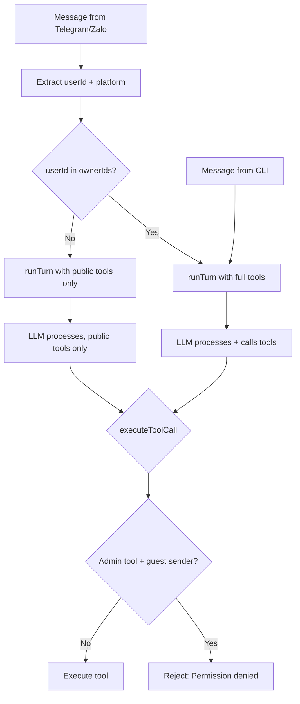

# Auth Permission System for Nightclaw

## Context

Currently anyone who messages the Telegram/Zalo bot has full access -- they can read/write config, run shell commands, start/stop services, create jobs. We need permissions: **owner** (Yuka) gets full access, **guest** gets normal chat replies only.

## Tasks

- [ ] Add AuthConfig type and patchAuthConfig to src/config/index.ts
- [ ] Create src/auth/index.ts with SenderContext, isOwner(), ADMIN_TOOLS, getToolsForSender()
- [ ] Update runTurn and executeToolCall in src/agent/index.ts to accept and check SenderContext
- [ ] Update system-prompt.ts to inject permission context for guest/owner
- [ ] Update telegram adapter to pass SenderContext (msg.from.id)
- [ ] Update zalo adapter to pass SenderContext (uidFrom)
- [ ] Extend save_config/read_config to support service=auth for configuring ownerIds
- [ ] Pass SenderContext platform=cli for CLI callers (interactive, serve, one-shot)

## Design

### 1. New auth config in `nightclaw.config.json`

Add an `auth` field to [src/config/index.ts](src/config/index.ts):

```typescript
export type AuthConfig = {
  ownerIds?: {
    telegram?: string[];  // Telegram user IDs (numeric strings)
    zalo?: string[];      // Zalo UIDs
  };
};

export type NightclawConfig = {
  llm: LlmConfig;
  prompt?: PromptConfig;
  services?: ServiceEntry[];
  state?: StateConfig;
  scheduler?: SchedulerConfig;
  auth?: AuthConfig;          // <-- new
};
```

Example config:
```json
{
  "auth": {
    "ownerIds": {
      "telegram": ["123456789"],
      "zalo": ["987654321"]
    }
  }
}
```

### 2. SenderContext type

Create new file [src/auth/index.ts](src/auth/index.ts) with auth logic:

```typescript
export type SenderContext = {
  userId: string;
  platform: "telegram" | "zalo" | "cli";
  displayName?: string;
};
```

- **CLI** is always owner (local access = owner)
- **Telegram/Zalo**: check if userId is in `auth.ownerIds[platform]`

### 3. Tool classification

Defined in [src/auth/index.ts](src/auth/index.ts):

- **Admin tools** (owner only): `save_config`, `read_config`, `run_shell`, `start_service`, `stop_service`, `create_job`, `cancel_job`, `update_notes`, `read_state`
- **Public tools** (anyone can use): `read_skill`, `list_services`, `list_jobs`

### 4. Update `runTurn` to accept SenderContext

In [src/agent/index.ts](src/agent/index.ts):

- `runTurn(userInput, session, config)` --> `runTurn(userInput, session, config, sender?)`
- If `sender` exists and is **not** owner:
  - Filter out admin tools when calling `callLlm` (only pass public tools)
  - Inject system message: "The current user is a guest. Do not attempt admin operations."
- If `sender` is owner or CLI: keep full tools as-is
- Add double-check in `executeToolCall`: if tool is admin and sender is not owner --> reject

### 5. Update Telegram adapter

In [src/skills/telegram/adapter.ts](src/skills/telegram/adapter.ts):

- Extract `msg.from?.id` (number) as `userId`
- Pass `SenderContext` to `runTurn`:

```typescript
const sender: SenderContext = {
  userId: String(msg.from?.id ?? chatId),
  platform: "telegram",
  displayName: senderName,
};
void runTurn(text, session, config, sender).then(...)
```

### 6. Update Zalo adapter

In [src/skills/zalo/adapter.ts](src/skills/zalo/adapter.ts):

- Extract `message.data.uidFrom` as `userId`
- Pass `SenderContext` to `runTurn`:

```typescript
const sender: SenderContext = {
  userId: String(message.data.uidFrom),
  platform: "zalo",
  displayName: senderName,
};
void runTurn(text, session, config, sender).then(...)
```

### 7. `save_config` support for auth

Extend `save_config` to let the owner configure auth via chat:
- `save_config` with `service: "auth"`, key `telegram` or `zalo`, value is the user ID to add

Handling in `executeToolCall`:

```typescript
case "save_config": {
  if (service === "auth") {
    // patch auth.ownerIds[key] — append value to the array
  }
}
```

### 8. System prompt update

In [src/agent/system-prompt.ts](src/agent/system-prompt.ts), add permission context:
- For guest: "The current user is a guest. Only respond conversationally. Do not attempt admin operations."
- For owner: "The current user is the owner. Full access granted."

## Overall flow



## Files to modify

- [src/config/index.ts](src/config/index.ts) -- add `AuthConfig` type, `patchAuthConfig`
- **[src/auth/index.ts](src/auth/index.ts)** (new) -- `SenderContext`, `isOwner()`, `ADMIN_TOOLS`, `getToolsForSender()`
- [src/agent/index.ts](src/agent/index.ts) -- update `runTurn` and `executeToolCall` to accept and check `SenderContext`
- [src/agent/tools.ts](src/agent/tools.ts) -- add `"auth"` to `save_config` service enum
- [src/agent/system-prompt.ts](src/agent/system-prompt.ts) -- add permission context
- [src/skills/telegram/adapter.ts](src/skills/telegram/adapter.ts) -- pass `SenderContext`
- [src/skills/zalo/adapter.ts](src/skills/zalo/adapter.ts) -- pass `SenderContext`
- [src/cli/index.ts](src/cli/index.ts) -- pass `SenderContext` with platform=cli (optional, since CLI defaults to owner)
