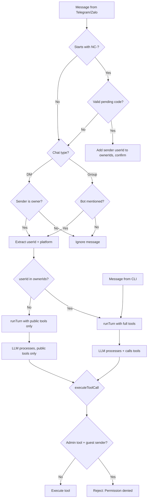
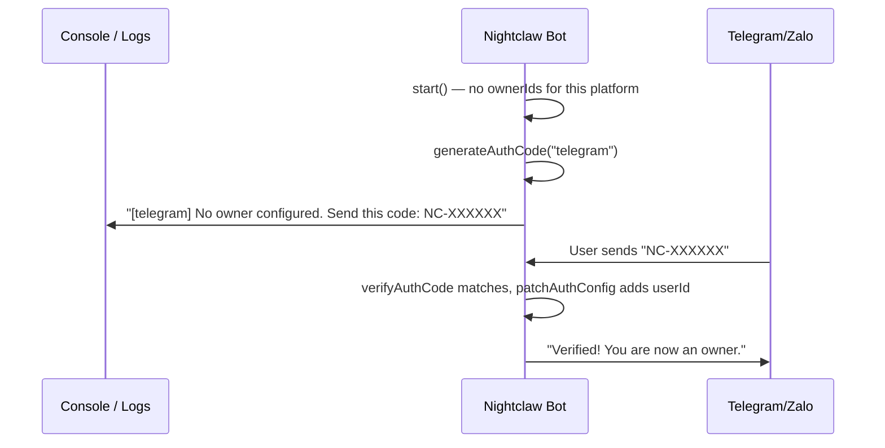
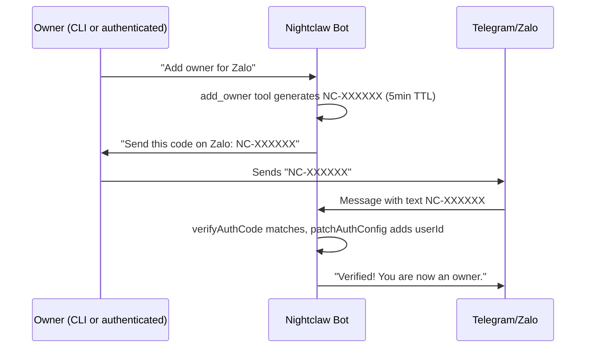

# Auth Permission System for Nightclaw

## Context

Currently anyone who messages the Telegram/Zalo bot has full access -- they can read/write config, run shell commands, start/stop services, create jobs. We need permissions: **owner** (Yuka) gets full access, **guest** gets normal chat replies only.

## Tasks

- [ ] Add AuthConfig type and patchAuthConfig to src/config/index.ts
- [ ] Create src/auth/index.ts with SenderContext, isOwner(), ADMIN_TOOLS, getToolsForSender()
- [ ] Add verification code logic (generateAuthCode, verifyAuthCode) to src/auth/index.ts
- [ ] Add `add_owner` tool definition to src/agent/tools.ts
- [ ] Update runTurn and executeToolCall in src/agent/index.ts to accept and check SenderContext
- [ ] Update system-prompt.ts to inject permission context for guest/owner
- [ ] Update telegram adapter: message filtering (DM owner-only, group mention-only) + verification codes + SenderContext
- [ ] Update zalo adapter: message filtering (DM owner-only, group mention-only) + verification codes + SenderContext
- [ ] Extend save_config/read_config to support service=auth for configuring ownerIds
- [ ] Pass SenderContext platform=cli for CLI callers (interactive, serve, one-shot)

## Design

### 1. New auth config in `nightclaw.config.json`

Add an `auth` field to [src/config/index.ts](src/config/index.ts):

```typescript
export type AuthConfig = {
  ownerIds?: {
    telegram?: string[];  // Telegram user IDs (numeric strings)
    zalo?: string[];      // Zalo UIDs
  };
};

export type NightclawConfig = {
  llm: LlmConfig;
  prompt?: PromptConfig;
  services?: ServiceEntry[];
  state?: StateConfig;
  scheduler?: SchedulerConfig;
  auth?: AuthConfig;          // <-- new
};
```

Example config:
```json
{
  "auth": {
    "ownerIds": {
      "telegram": ["123456789"],
      "zalo": ["987654321"]
    }
  }
}
```

### 2. SenderContext type

Create new file [src/auth/index.ts](src/auth/index.ts) with auth logic:

```typescript
export type SenderContext = {
  userId: string;
  platform: "telegram" | "zalo" | "cli";
  displayName?: string;
};
```

- **CLI** is always owner (local access = owner)
- **Telegram/Zalo**: check if userId is in `auth.ownerIds[platform]`

### 3. Owner verification via code challenge

Owners don't need to know their platform user ID upfront. Verification happens **automatically on connect**:

**Auto-verify on startup** — when a service starts and no owner is configured for that platform:

1. The adapter checks `config.auth?.ownerIds?.[platform]` — if empty/missing, generates a code automatically
2. The code is printed to console: `[telegram] No owner configured. Send this code to the bot: NC-A7X9K2`
3. The owner opens Telegram/Zalo and sends `NC-A7X9K2` to the bot
4. The adapter intercepts the code, extracts the sender's userId, and saves it to `auth.ownerIds`
5. The bot confirms: "Verified! You are now an owner."

**Manual add_owner** — for adding additional owners later (when an owner already exists), the `add_owner` tool is still available via chat.

Implementation in [src/auth/index.ts](src/auth/index.ts):

```typescript
const pendingCodes = new Map<string, { platform: string; expiresAt: number }>();

export function generateAuthCode(platform: "telegram" | "zalo"): string {
  // Generate random code like "NC-A7X9K2", store with 5-minute TTL
}

export function verifyAuthCode(code: string, platform: string): boolean {
  // Check if code exists, matches platform, and hasn't expired
  // If valid: delete from pending and return true
}
```

Auto-verify in adapters (called inside `start()`):

```typescript
// In telegram/zalo adapter start(), after successful connection:
const owners = config.auth?.ownerIds?.[platform] ?? [];
if (owners.length === 0) {
  const code = generateAuthCode(platform);
  console.log(`[${platform}] No owner configured. Send this code to the bot: ${code}`);
}
```

`add_owner` tool in [src/agent/tools.ts](src/agent/tools.ts) (for adding extra owners later):

```typescript
{
  type: "function",
  function: {
    name: "add_owner",
    description: "Generate a verification code to add an owner for a platform. The user must send this code on the target platform to complete verification.",
    parameters: {
      type: "object",
      properties: {
        platform: { type: "string", enum: ["telegram", "zalo"] }
      },
      required: ["platform"]
    }
  }
}
```

### 4. Tool classification

Defined in [src/auth/index.ts](src/auth/index.ts):

- **Admin tools** (owner only): `save_config`, `read_config`, `run_shell`, `start_service`, `stop_service`, `create_job`, `cancel_job`, `update_notes`, `read_state`, `add_owner`
- **Public tools** (anyone can use): `read_skill`, `list_services`, `list_jobs`

### 5. Message filtering rules

Before any auth check or `runTurn` call, each adapter applies these rules:

| Chat type | Rule |
|-----------|------|
| **Private / DM** | Only reply if the sender is an **owner**. Guests are silently ignored. |
| **Group** | Only reply when the bot is **mentioned** (e.g. `@botUsername` on Telegram, tagged on Zalo). Non-mentioned messages are ignored regardless of sender role. |

Verification codes (`NC-*`) bypass these rules — they are always processed so the owner can complete verification from any context.

**Telegram** — detecting chat type and mentions:
- `msg.chat.type === "private"` → DM
- `msg.chat.type === "group" | "supergroup"` → group
- Mention check: search `msg.entities` for `type: "mention"` matching `@botUsername`, or `type: "bot_command"`. The bot username is obtained from `bot.getMe()` at startup.

**Zalo** — detecting chat type and mentions:
- `message.type === ThreadType.Group` (already detected in current code)
- `message.type === ThreadType.User` → DM
- Mention check: zca-js `message.data.mentions` or look for the bot's own UID in the mention list. The bot UID is obtained from `zaloApi.getOwnId()` at startup.

### 6. Update `runTurn` to accept SenderContext

In [src/agent/index.ts](src/agent/index.ts):

- `runTurn(userInput, session, config)` --> `runTurn(userInput, session, config, sender?)`
- If `sender` exists and is **not** owner:
  - Filter out admin tools when calling `callLlm` (only pass public tools)
  - Inject system message: "The current user is a guest. Do not attempt admin operations."
- If `sender` is owner or CLI: keep full tools as-is
- Add double-check in `executeToolCall`: if tool is admin and sender is not owner --> reject

### 7. Update Telegram adapter

In [src/skills/telegram/adapter.ts](src/skills/telegram/adapter.ts):

- Store `botUsername` from `bot.getMe()` at startup
- **Intercept verification codes** (`NC-*`) — always process regardless of chat type
- **Apply message filtering** — DM: owner-only; group: mention-only
- Pass `SenderContext` to `runTurn`

```typescript
const me = await bot.getMe();
const botUsername = me.username ?? "";

// Auto-verify: generate code if no owner configured for telegram
const telegramOwners = config.auth?.ownerIds?.telegram ?? [];
if (telegramOwners.length === 0) {
  const code = generateAuthCode("telegram");
  console.log(`[telegram] No owner configured. Send this code to @${botUsername}: ${code}`);
}

bot.on("message", (msg) => {
  const chatId = msg.chat.id;
  const text = msg.text;
  if (!text) return;

  const userId = String(msg.from?.id ?? chatId);
  const isGroup = msg.chat.type === "group" || msg.chat.type === "supergroup";

  // 1. Verification codes — always process
  if (text.startsWith("NC-")) {
    const matched = verifyAuthCode(text.trim(), "telegram");
    if (matched) {
      await patchAuthConfig("telegram", userId);
      bot.sendMessage(chatId, "Verified! You are now an owner on Telegram.");
      return;
    }
  }

  // 2. Group messages — only respond when mentioned
  if (isGroup) {
    const mentioned = (msg.entities ?? []).some(
      (e) => e.type === "mention" && text.slice(e.offset, e.offset + e.length) === `@${botUsername}`
    );
    if (!mentioned) return;
  }

  // 3. DM — only respond to owners
  if (!isGroup && !isOwner({ userId, platform: "telegram" }, config)) return;

  const sender: SenderContext = {
    userId,
    platform: "telegram",
    displayName: senderName,
  };
  void runTurn(text, session, config, sender).then(...)
});
```

### 8. Update Zalo adapter

In [src/skills/zalo/adapter.ts](src/skills/zalo/adapter.ts):

- Store `ownUid` from `zaloApi.getOwnId()` at startup (already available)
- **Intercept verification codes** (`NC-*`) — always process
- **Apply message filtering** — DM: owner-only; group: mention-only
- Pass `SenderContext` to `runTurn`

```typescript
const ownUid = zaloApi.getOwnId();

// Auto-verify: generate code if no owner configured for zalo
const zaloOwners = config.auth?.ownerIds?.zalo ?? [];
if (zaloOwners.length === 0) {
  const code = generateAuthCode("zalo");
  console.log(`[zalo] No owner configured. Send this code to the bot: ${code}`);
}

zaloApi.listener.on("message", (message: Message) => {
  if (message.isSelf) return;
  const text = extractText(message);
  if (!text.trim()) return;

  const userId = String(message.data.uidFrom);
  const isGroup = message.type === ThreadType.Group;

  // 1. Verification codes — always process
  if (text.startsWith("NC-")) {
    const matched = verifyAuthCode(text.trim(), "zalo");
    if (matched) {
      await patchAuthConfig("zalo", userId);
      await api.sendMessage("Verified! You are now an owner on Zalo.", message.threadId, message.type);
      return;
    }
  }

  // 2. Group messages — only respond when mentioned
  if (isGroup) {
    const mentions = message.data.mentions; // check if bot UID is in mentions
    const mentioned = mentions?.some((m) => String(m.uid) === ownUid);
    if (!mentioned) return;
  }

  // 3. DM — only respond to owners
  if (!isGroup && !isOwner({ userId, platform: "zalo" }, config)) return;

  const sender: SenderContext = {
    userId,
    platform: "zalo",
    displayName: senderName,
  };
  void runTurn(text, session, config, sender).then(...)
});
```

### 9. `save_config` support for auth

Extend `save_config` to let the owner configure auth via chat:
- `save_config` with `service: "auth"`, key `telegram` or `zalo`, value is the user ID to add

Handling in `executeToolCall`:

```typescript
case "save_config": {
  if (service === "auth") {
    // patch auth.ownerIds[key] — append value to the array
  }
}
```

### 10. System prompt update

In [src/agent/system-prompt.ts](src/agent/system-prompt.ts), add permission context:
- For guest: "The current user is a guest. Only respond conversationally. Do not attempt admin operations."
- For owner: "The current user is the owner. Full access granted."

## Overall flow



## Owner verification flow

### Auto-verify on first connect (no owner configured yet)



### Manual add_owner (adding extra owners later)



## Files to modify

- [src/config/index.ts](src/config/index.ts) -- add `AuthConfig` type, `patchAuthConfig`
- **[src/auth/index.ts](src/auth/index.ts)** (new) -- `SenderContext`, `isOwner()`, `ADMIN_TOOLS`, `getToolsForSender()`, `generateAuthCode()`, `verifyAuthCode()`
- [src/agent/index.ts](src/agent/index.ts) -- update `runTurn` and `executeToolCall` to accept and check `SenderContext`; handle `add_owner` tool call
- [src/agent/tools.ts](src/agent/tools.ts) -- add `add_owner` tool definition, add `"auth"` to `save_config` service enum
- [src/agent/system-prompt.ts](src/agent/system-prompt.ts) -- add permission context
- [src/skills/telegram/adapter.ts](src/skills/telegram/adapter.ts) -- message filtering (DM owner-only, group mention-only), intercept verification codes, pass `SenderContext`
- [src/skills/zalo/adapter.ts](src/skills/zalo/adapter.ts) -- message filtering (DM owner-only, group mention-only), intercept verification codes, pass `SenderContext`
- [src/cli/index.ts](src/cli/index.ts) -- pass `SenderContext` with platform=cli (optional, since CLI defaults to owner)
